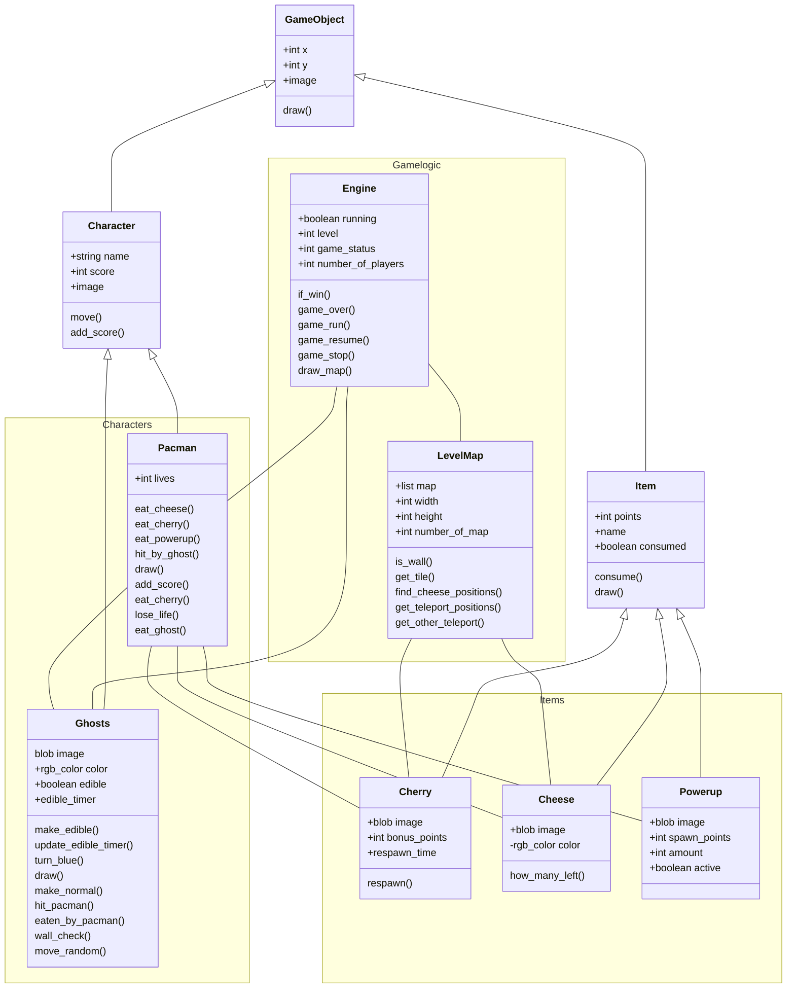

```mermaid
classDiagram
direction TB

class GameObject {
    +int x
    +int y
    +image
    draw()
}

class Character {
    +string name
    +int score
    +image
    move()
    add_score()
}

class Item {
    +int points
    +name
    +boolean consumed
    consume()
    draw()
}

namespace Gamelogic {
    class Engine {
        +boolean running
        +int level
        +int game_status
        +int number_of_players
        if_win()
        game_over()
        game_run()
        game_resume()
        game_stop()
        draw_map()
    }

    class LevelMap {
        +list map
        +int width
        +int height
        +int number_of_map
        is_wall()
        get_tile()
        find_cheese_positions()
        get_teleport_positions()
        get_other_teleport()
    }
}

namespace Characters {
    class Pacman {
        +int lives
        eat_cheese()
        eat_cherry()
        eat_powerup()
        hit_by_ghost()
        draw()
        add_score()
        eat_cherry()
        lose_life()
        eat_ghost()
    }

    class Ghosts {
        blob image
        +rgb_color color
        +boolean edible
        +edible_timer
        make_edible()
        update_edible_timer()
        turn_blue()
        draw()
        make_normal()
        hit_pacman()
        eaten_by_pacman()
        wall_check()
        move_random()
        
    }
}

namespace Items {
    class Cherry {
        +blob image
        +int bonus_points
        +respawn_time
        respawn()
    }

    class Cheese {
        +blob image
        -rgb_color color
        how_many_left()
    }

    class Powerup {
        +blob image
        +int spawn_points
        +int amount
        +boolean active
    }
}

GameObject <|-- Character
Character <|-- Pacman
Character <|-- Ghosts

GameObject <|-- Item
Item <|-- Cheese
Item <|-- Cherry
Item <|-- Powerup

Engine -- LevelMap
Engine -- Pacman
Engine -- Ghosts
LevelMap -- Cheese
LevelMap -- Cherry
Pacman -- Cheese
Pacman -- Cherry
Pacman -- Ghosts
Pacman -- Powerup
```
