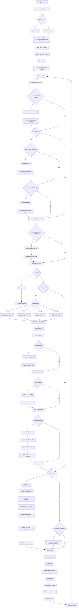

```mermaid 
flowchart TD
    A[Start programma] --> B[Lees player_id uit sys.argv]
    B --> C{Is player_id p1?}
    C -->|Ja| D[is_host = True]
    C -->|Nee| E[is_host = False]

    D --> F[Maak LevelMap Scoreboard Items Pacman Engine en Ghosts]
    E --> F
    F --> G[Maak MQTTManager]
    G --> H[Verbind met MQTT broker]
    H --> I[Start game]
    I --> J[Laad cherry en powerup images]
    J --> K[Start game loop]

    K --> L[Haal current_time op]
    L --> M{Host power mode verlopen?}
    M -->|Ja| N[Maak alle ghosts normaal]
    N --> O[power_mode_end_time wordt 0]
    M -->|Nee| P{Is speler host?}
    O --> P

    P -->|Ja| Q{Cherry spawn tijd voorbij?}
    Q -->|Ja| R[Respawn cherry]
    R --> S[Update scoreboard via MQTT]
    Q -->|Nee| T{Powerup spawn tijd voorbij?}
    S --> T

    T -->|Ja| U[Respawn powerup]
    U --> V[Update scoreboard via MQTT]
    T -->|Nee| W[Check lokale power mode]
    V --> W
    P -->|Nee| W

    W --> X{Pacman power mode verlopen?}
    X -->|Ja| Y[Pacman power mode uit]
    Y --> Z[Maak alle ghosts normaal]
    X -->|Nee| AA[Lees pygame events]
    Z --> AA

    AA --> AB{Event QUIT?}
    AB -->|Ja| AC[Stop game]
    AB -->|Nee| AD{Toets ingedrukt?}

    AD -->|Ja| AE{Welke richting?}
    AE -->|Links| AF[Pacman move LEFT]
    AE -->|Rechts| AG[Pacman move RIGHT]
    AE -->|Omhoog| AH[Pacman move UP]
    AE -->|Omlaag| AI[Pacman move DOWN]

    AF --> AJ[Beweging is uitgevoerd]
    AG --> AJ
    AH --> AJ
    AI --> AJ

    AD -->|Nee| BA{Is speler host?}

    AJ --> AK[Teleport check]
    AK --> AL[Check kaas eten]
    AL --> AM{Kaas gegeten?}
    AM -->|Ja| AN[Score plus 10 als host]
    AN --> AO[Publiceer cheese eaten]
    AM -->|Nee| AP[Check cherry eten]
    AO --> AP

    AP --> AQ{Cherry gegeten?}
    AQ -->|Ja| AR[Score plus 100 als host]
    AR --> AS[Publiceer item eaten cherry]
    AQ -->|Nee| AT[Check powerup eten]
    AS --> AT

    AT --> AU{Powerup gegeten?}
    AU -->|Ja| AV[Score plus 50 als host]
    AV --> AW[Power mode 15 seconden]
    AW --> AX[Ghosts worden edible]
    AX --> AY[Publiceer item eaten powerup]
    AU -->|Nee| AZ[Publiceer move]
    AY --> AZ
    AZ --> BA

    BA -->|Ja| BB[Host logica]
    BB --> BC[Beweeg ghosts random]
    BC --> BD[Check botsing met host Pacman]
    BD --> BE[Check botsing met andere spelers]
    BE --> BF[Verwerk cheese eaten message]
    BF --> BG[Verwerk item eaten message]
    BG --> BH[Publiceer world state]

    BA -->|Nee| BI{Client heeft world state?}
    BI -->|Ja| BJ[Sync ghosts cherry powerup en cheese]
    BI -->|Nee| BK[Draw scherm]
    BJ --> BK
    BH --> BK

    BK --> BL[Maak scherm zwart]
    BL --> BM[Teken map]
    BM --> BN[Teken cheese cherry en powerup]
    BN --> BO[Teken ghosts]
    BO --> BP[Teken andere spelers]
    BP --> BQ[Teken eigen Pacman]
    BQ --> BR[Update scherm]
    BR --> BS[Wacht tot 10 FPS]
    BS --> K

    AC --> BT[Einde programma]

```