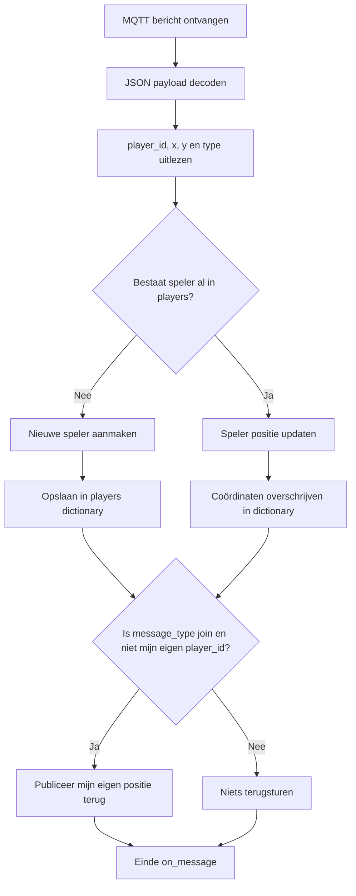

```mermaid
flowchart TD
    A[MQTT bericht ontvangen] --> B[JSON payload decoden]
    B --> C[player_id, x, y en type uitlezen]

    C --> D{Bestaat speler al in players?}

    D -->|Nee| E[Nieuwe speler aanmaken]
    E --> E2[Opslaan in players dictionary]

    D -->|Ja| F[Speler positie updaten]
    F --> F2[Coördinaten overschrijven in dictionary]

    E2 --> G{Is message_type join en niet mijn eigen player_id?}
    F2 --> G

    G -->|Ja| H[Publiceer mijn eigen positie terug]
    G -->|Nee| I[Niets terugsturen]

    H --> J[Einde on_message]
    I --> J
```