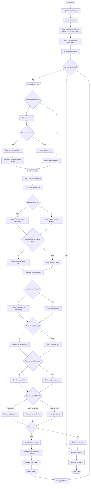

```mermaid
flowchart TD
    A([Start game]) --> B[Engine start game_run]
    B --> C[LevelMap laden]
    C --> D[Pacman, Ghosts, Cheese, Cherry en Powerup maken]
    D --> E[MQTT verbinden en subscriben]
    E --> F[Publiceer join bericht]
    F --> G{Game loop running?}

    G -->|Ja| H[/Lees Pygame input/]
    H --> I{Pijltjestoets ingedrukt?}

    I -->|Ja| J[Pacman.move]
    J --> K{Botsing met muur?}
    K -->|Ja| L[Beweging blokkeren]
    K -->|Nee| M[Pacman positie updaten]

    M --> N[Publiceer move bericht via MQTT]
    L --> O[Geen move publishen]
    I -->|Nee| O

    N --> P[[on_message]]
    O --> P

    P --> Q[MQTT bericht ontvangen]
    Q --> R[JSON payload decoden]
    R --> S{Bestaat speler al?}
    S -->|Nee| T[Nieuwe Pacman speler toevoegen]
    S -->|Ja| U[Andere speler positie updaten]

    T --> V{Join bericht van andere speler?}
    U --> V

    V -->|Ja| W[Publiceer eigen positie terug]
    V -->|Nee| X[Geen antwoord nodig]
    W --> Y[Controleer game-objecten]
    X --> Y

    Y --> Z{Pacman raakt Cheese?}
    Z -->|Ja| AA[Cheese consumed en score erbij]
    Z -->|Nee| AB[Geen cheese score]

    AA --> AC{Pacman raakt Cherry?}
    AB --> AC

    AC -->|Ja| AD[Bonuspunten toevoegen]
    AC -->|Nee| AE[Geen bonuspunten]

    AD --> AF{Pacman raakt Powerup?}
    AE --> AF

    AF -->|Ja| AG[Ghosts make_edible]
    AF -->|Nee| AH[Ghosts blijven normaal]

    AG --> AI{Pacman raakt Ghost?}
    AH --> AI

    AI -->|Ghost edible| AJ[Pacman krijgt punten]
    AI -->|Ghost niet edible| AK[Pacman verliest leven]
    AI -->|Geen botsing| AL[Geen ghost actie]

    AJ --> AM{Game over?}
    AK --> AM
    AL --> AM

    AM -->|Ja| AN[Engine game_over]
    AM -->|Nee| AO[LevelMap draw_map]

    AO --> AP[Draw Cheese, Cherry en Powerup]
    AP --> AQ[Draw Pacman spelers]
    AQ --> AR[Draw Ghosts]
    AR --> AS[Display updaten]
    AS --> G

    G -->|Nee| AT[MQTT disconnect]
    AN --> AT
    AT --> AU[Pygame afsluiten]
    AU --> AV([Einde game])

```