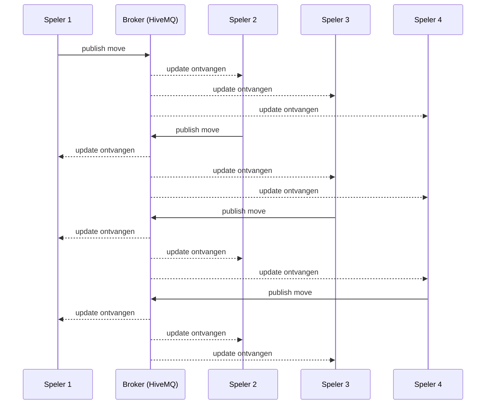

```mermaid
sequenceDiagram
    participant P1 as Speler 1
    participant B as Broker (HiveMQ)
    participant P2 as Speler 2
    participant P3 as Speler 3
    participant P4 as Speler 4

    P1->>B: publish move
    B-->>P2: update ontvangen
    B-->>P3: update ontvangen
    B-->>P4: update ontvangen

    P2->>B: publish move
    B-->>P1: update ontvangen
    B-->>P3: update ontvangen
    B-->>P4: update ontvangen

    P3->>B: publish move
    B-->>P1: update ontvangen
    B-->>P2: update ontvangen
    B-->>P4: update ontvangen

    P4->>B: publish move
    B-->>P1: update ontvangen
    B-->>P2: update ontvangen
    B-->>P3: update ontvangen
```